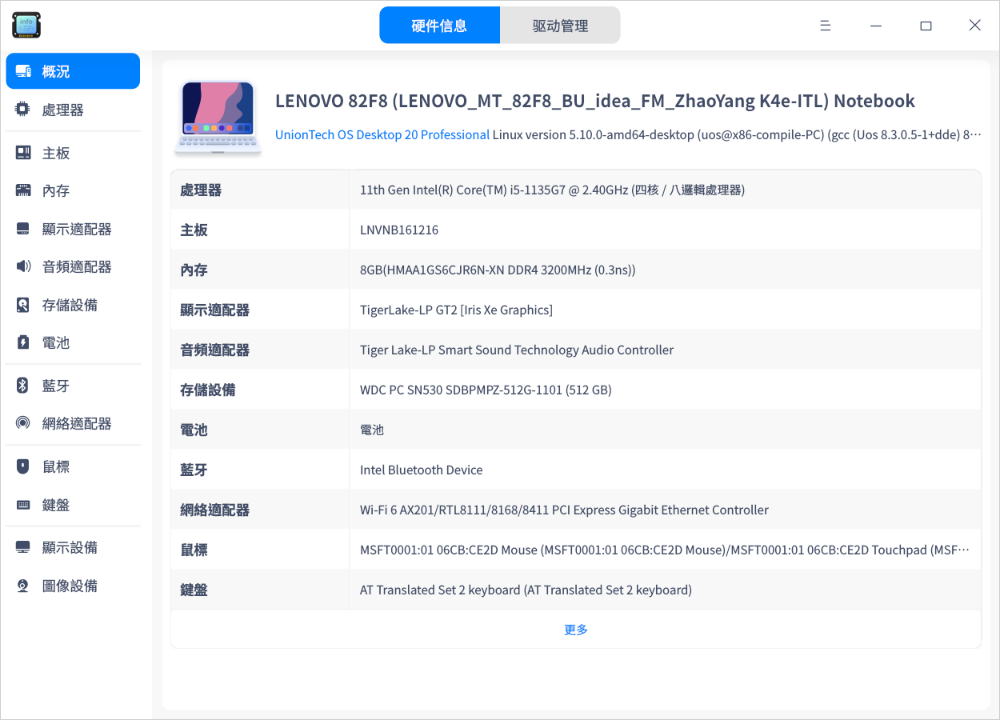
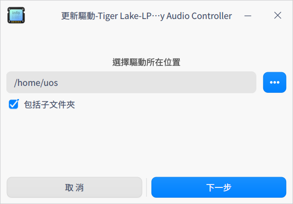
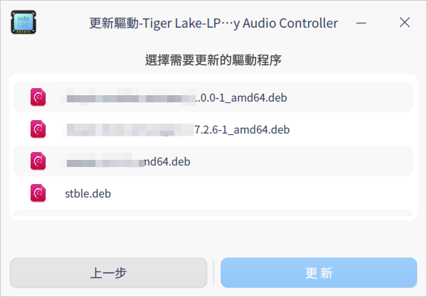
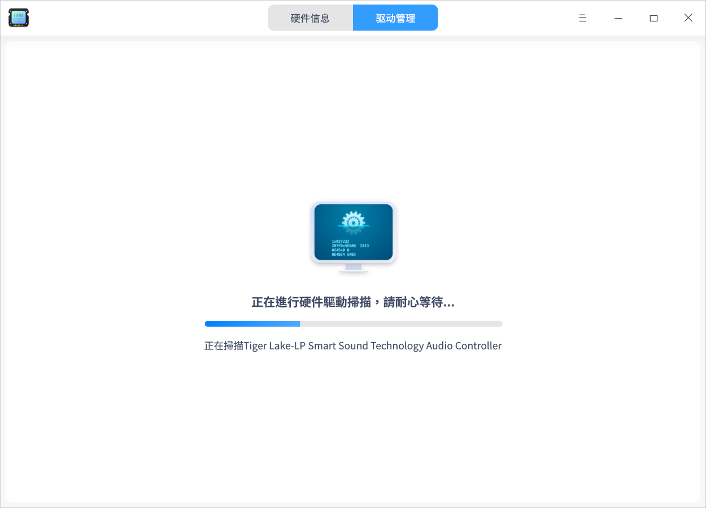
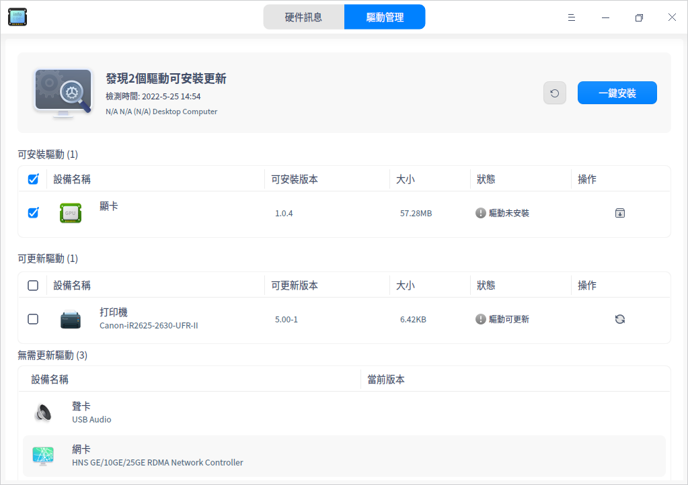

# 設備管理器|deepin-devicemanager|

## 概述

設備管理器是查看和管理硬件設備的工具，可以查看運行在操作系統的硬件設備信息，並進行驅動管理。

## 使用入門

您可以通過以下方式運行或關閉設備管理器，或者創建快捷方式。

### 運行設備管理器

1. 單擊任務欄上的啟動器圖標 ，進入啟動器界面。
2. 上下滾動鼠標滾輪瀏覽或通過搜索，找到設備管理器圖標 ，單擊運行。
3. 右鍵單擊 ，您可以：
   - 單擊 **傳送到桌面**，在桌面創建快捷方式。

   - 單擊 **傳送到任務欄**，將應用程序固定到快速工具列。

   - 單擊 **加至開機啟動**，將應用程序添加到開機啟動項，在電腦開機時自動運行該應用程序。

### 關閉設備管理器

- 在設備管理器界面，單擊 ，退出設備管理器。
- 右鍵單擊任務欄上的 ，選擇 **關閉所有** 來退出設備管理器。
- 在設備管理器界面單擊 ，選擇 **退出** 來退出設備管理器。

## 硬件訊息

設備管理器展示的設備訊息與電腦硬件相關，如果您的電腦接入鼠標、鍵盤等設備，則會顯示對應的設備訊息。如果檢測到多個同類型設備，則以列表形式顯示設備訊息。

### 設備訊息

在設備管理器界面，單擊 **硬件訊息**，查看運行在操作系統上的硬件詳細訊息。

下表主要介紹常見的硬件訊息，僅作參考，請以實際情況為準。

<table class="block1">
    <caption></caption>
    <tbody>
        <tr>
            <td width="150px"><b>硬件名稱</b></td>
            <td><b>硬件訊息</b></td>
        </tr>
        <tr>
            <td>概況</td>
            <td>展示操作系統內核訊息及各硬件設備列表。</td>
        </tr>
        <tr>
            <td>處理器</td>
            <td>展示處理器的名稱、製造商、處理器及架構等訊息。</td>
        </tr>
        <tr>
            <td>主板</td>
            <td>展示主板的製造商、版本、晶片組、SMBIOS版本等訊息。</td>
        </tr>
         <tr>
            <td>內存</td>
            <td>展示內存的名稱、製造商、大小、類型及速度等訊息。</td>
      </tr>
      <tr>
            <td>顯示適配器</td>
            <td>展示顯示適配器的名稱、製造商、型號等訊息。</td>
        </tr>
       <tr>
            <td>音頻適配器</td>
            <td>展示音頻適配器的名稱、製造商及型號等訊息。</td>
        </tr>
         <tr>
            <td>存儲設備</td>
            <td>展示存儲設備的型號、製造商、介質類型等訊息。</td>
        </tr>
        <tr>
            <td>網絡適配器</td>
            <td>展示網絡適配器的名稱、製造商、類型及驅動等訊息。</td>
        </tr>
         <tr>
            <td>鼠標</td>
            <td>展示鼠標的名稱、製造商、型號及接口等訊息。</td>
        </tr>
          <tr>
            <td>鍵盤</td>
            <td>展示鍵盤的名稱、型號、製造商、接口等訊息。</td>
        </tr>
        <tr>
            <td>顯示設備</td>
            <td>展示顯示設備的名稱、製造商、類型、接口類型等訊息。</td>
        </tr>
   </tbody>
   </table>

### 右鍵菜單

在設備詳細訊息區域，單擊右鍵，可以進行相關操作。

#### 複製

複製當前頁面的所有訊息。對於可選中的訊息，也可以局部複製。

#### 刷新

將重新加載操作系統當前所有設備的訊息，快捷鍵為 **F5**。

#### 導出

將設備訊息導出到指定的文件夾，支持導出 txt/docx/xls/html 格式。

#### 禁用/啟用

部分硬件驅動支持禁用和啟用功能，硬件驅動默認是啟用狀態，根據右鍵菜單選項判斷是否支持禁用功能。

#### 更新驅動

部分硬件支持更新/卸載驅動功能，可以根據右鍵菜單選項進行判斷。

> 竅門：在驅動管理界面，支持在線更新驅動。

1. 在右鍵菜單中選擇 **更新驅動**，彈出窗口。

2. 選擇驅動所在的文件夾，單擊 **下一步** 按鈕。默認勾選「包括子文件夾」，表示檢測文件夾以及子文件夾中包含的驅動文件。

   

3. 系統會檢測該文件位置包含的所有可安裝的deb和ko格式驅動文件，選擇對應的驅動文件後，單擊 **更新** 按鈕。

   

4. 彈出認證窗口，輸入系統登錄密碼完成認證後進行更新。

5. 如果更新失敗了，系統自動將該設備的驅動回滾至之前的驅動版本，不影響使用。建議根據系統提示查找失敗原因，重新更新。

#### 卸載驅動

對於不想使用的設備，可以卸載驅動。

1. 在右鍵菜單中選擇 **卸載驅動**，二次確認後，單擊 **卸載** 按鈕。

   - 卸載成功：設備狀態變為不可用。

   - 卸載失敗：原驅動正常使用，建議根據系統提示查找失敗原因，重新卸載。

2. 如果想重新使用該設備，在設備詳細訊息頁面單擊右鍵，並選擇 **更新驅動** 安裝驅動。

#### 喚起電腦

當電腦待機時，支持通過鼠標、鍵盤和網卡喚起電腦，點亮螢幕。如果設備禁用，則無法使用該功能。

**通過鼠標和鍵盤喚起電腦**

1. 在硬件訊息界面，單擊 **鼠標** 或 **鍵盤**，顯示設備詳細訊息。

2. 在詳細訊息區域單擊右鍵，可以勾選或去勾選 **允許喚起電腦**。

   - 允許喚起電腦：電腦處於待機狀態時，左擊/右擊/單擊鼠標中鍵或敲擊該鍵盤任意鍵，可將電腦喚起，點亮螢幕。

   - 不允許喚起電腦：電腦處於待機狀態時，左擊/右擊/單擊鼠標中鍵或敲擊鍵盤，電腦無響應。

**通過網卡喚起電腦**

1. 在硬件訊息界面，單擊 **網絡適配器**，顯示設備詳細訊息。

2. 在詳細訊息區域單擊右鍵，可以勾選或去勾選 **允許喚起電腦**。

   - 允許喚起電腦：本機處於待機狀態時，其他電腦設備（在同一網段，即可以ping通對方ip）向本機發送特殊網絡包請求（Wake On LAN 命令），可將本機喚起，點亮螢幕。

   - 不允許喚起電腦：電腦處於待機狀態時，其他電腦設備（在同一網段，即可以ping通對方ip）向本機發送特殊網絡包請求（Wake On  LAN 命令），本機無響應。

## 驅動管理

驅動管理主要包括驅動列表信息、驅動更新檢測、驅動在線安裝等內容。

### 驅動更新檢測

打開設備管理器，單擊 **驅動管理**，系統會自動檢測是否有可更新/安裝的驅動。

> 說明：當啟動電腦時，如果檢測到有可更新/安裝的驅動，會彈出提示訊息，單擊 **查看** 按鈕則可以進入驅動管理界面。

- 無更新：表示沒有可更新/安裝的驅動，展示無需更新驅動的設備名稱及版本。
- 有更新：表示檢測到可更新/安裝的驅動，可以進行在線安裝。

如果顯示檢測失敗，根據提示訊息修復問題後單擊 **重新檢測** 再次檢測，對於未知的原因則可以單擊 **反饋** 按鈕跳轉到「服務與支持」應用的留言諮詢界面，反饋相關問題。

### 驅動在線安裝

1. 在驅動管理界面，可以查看可更新/安裝的驅動列表，並進行在線安裝。

   - 對於可安裝的驅動，單擊安裝按鈕進行驅動安裝。

   - 對於可更新的驅動，單擊更新按鈕進行驅動更新。

   

2. 如果想要批量安裝，則可以勾選對應的驅動，單擊 **一鍵安裝**，將依次進行安裝。

3. 等待安裝結果。

   - 安裝成功：狀態欄變為「安裝成功」，重啟電腦後生效。

   - 安裝失敗：狀態欄變為「安裝失敗」，單擊操作欄按鈕再次嘗試安裝。或單擊狀態欄的「安裝失敗」查看失敗原因，對於未知的原因，可以單擊 **反饋** 按鈕跳轉到「服務與支持」應用的留言諮詢界面，反饋相關問題。
   - 部分安裝成功：對於批量安裝的驅動，可能部分安裝成功，部分安裝失敗，可以在驅動列表中查看對應驅動的狀態。
   

## 主菜單

在主菜單中，可以進行切換窗口主題，查看幫助手冊等操作。

### 主題

窗口主題包含淺色主題、深色主題和跟隨系統主題。

1. 在設備管理器界面，單擊 。
2. 單擊 **主題**，選擇一個主題顏色。

### 幫助

1. 在設備管理器界面，單擊 。
2. 單擊 **幫助**，查看幫助手冊，進一步了解和使用設備管理器。

### 關於

1. 在設備管理器界面，單擊 。
2. 單擊 **關於**，查看設備管理器的版本和介紹。

### 退出

1. 在設備管理器界面，單擊 。
2. 單擊 **退出**。